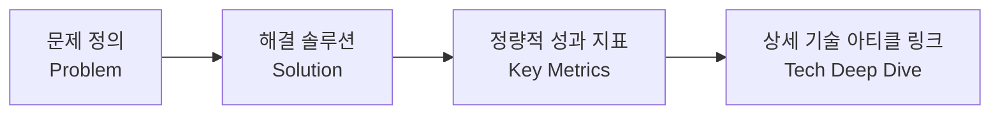

# 🚀 정적 블로그(VitePress) 고도화: 노션 스타일 태그 시스템과 인터랙티브 프로젝트 쇼케이스 구축기

개인 블로그(`uoosnn.com`)에 인프라 트러블슈팅, 침해사고 대응, 0원 서버리스 아키텍처 등 실무 중심의 기술 문서가 20편 가까이 누적되면서 한 가지 구조적인 과제에 직면했다.

> *"방문자와 채용 담당자가 수많은 기술 글 중에서 원하는 주제를 어떻게 1초 만에 찾아보게 할 것인가?"*  
> *"단순한 텍스트 이력서를 넘어, 실제 구축한 시스템 아키텍처와 정량적 성과를 어떻게 한눈에 증명할 것인가?"*

이 문제를 해결하기 위해 **VitePress 기반의 정적 사이트에 Vue 3 커스텀 컴포넌트와 SSG 빌드 타임 데이터 로더**를 결합하여 **노션(Notion) 스타일의 태그/라벨링 시스템**과 **인터랙티브 프로젝트 쇼케이스(`/projects`)**를 구축했다. 이 글에서는 그 설계 과정과 트러블슈팅 노하우를 공유한다.

---

## 1. 노션(Notion) 스타일 태그 & 라벨링 시스템 설계

### ① 문제 정의 및 UX 목표
마크다운 frontmatter에 `tags: [AWS, Security, Troubleshooting]`을 작성해 두었지만, 독자가 이를 직관적으로 인지하고 태그별로 글을 모아볼 수 있는 인터랙티브 UI가 부재했다.
우리는 대중에게 가장 친숙하고 가독성이 뛰어난 **노션(Notion) 데이터베이스의 파스텔톤 태그(Pill Badge)**를 벤치마킹하기로 결정했다.

### ② 도메인별 자동 색상 매핑 CSS
태그 이름에 따라 카테고리별 고유 색상이 자동으로 부여되도록 설계했다:
- 🔵 **Blue**: `AWS`, `Cloud`, `Network`, `Linux`, `RDS` (인프라/클라우드)
- 🟢 **Green**: `Troubleshooting`, `Performance`, `Automation` (성능/트러블슈팅)
- 🔴 **Red**: `Security`, `CVE`, `Incident`, `Forensic` (보안/침해사고)
- 🟣 **Purple**: `Serverless`, `Lambda`, `AI`, `Gemini`, `Architecture` (서버리스/인공지능)
- 🟡 **Yellow**: `Windows`, `WSL`, `MySQL`, `Database`, `C++` (데이터베이스/OS/언어)
- ⚪ **Gray**: `VitePress`, `Tech`, `Blog` (일반)

```css
/* Notion-style Pill Badge & Hover Micro-interaction */
.notion-tag {
  display: inline-flex;
  align-items: center;
  gap: 4px;
  font-size: 0.76rem;
  font-weight: 500;
  padding: 3px 8px;
  border-radius: 4px;
  transition: all 0.15s ease-in-out;
}
.notion-tag:hover {
  transform: translateY(-1px);
  filter: brightness(0.95);
  box-shadow: 0 2px 4px rgba(0, 0, 0, 0.06);
}
```

---

## 2. 빌드 타임 데이터 로더와 실시간 필터링 (`TagFilterBoard.vue`)

정적 사이트(SSG) 환경에서 모든 마크다운 파일을 브라우저 런타임에 파싱하는 것은 성능 저하(TBT 증가)의 원인이 된다.

따라서 VitePress의 내장 `createContentLoader`를 활용하여 **빌드 시점에 전체 포스트의 메타데이터(제목, 날짜, 태그, 요약문, 언어 코드)를 JSON 데이터로 컴파일**하는 `posts.data.mjs`를 구축했다:

```javascript
// .vitepress/theme/posts.data.mjs
import { createContentLoader } from 'vitepress'

export default createContentLoader(['blog/*.md', 'tech/*.md', 'en/blog/*.md', ...], {
  transform(raw) {
    return raw
      .filter(p => !p.url.endsWith('/') && !p.url.endsWith('index.html'))
      .map(p => ({
        title: p.frontmatter?.title || decodeURIComponent(p.url.split('/').pop()),
        date: p.frontmatter?.date ? new Date(p.frontmatter.date).toISOString().split('T')[0] : '',
        tags: p.frontmatter?.tags || [],
        description: p.frontmatter?.description || '',
        category: p.url.includes('/tech/') ? 'Tech' : 'Blog',
        lang: p.url.startsWith('/en/') ? 'en' : p.url.startsWith('/ja/') ? 'ja' : 'ko'
      }))
  }
})
```

이 데이터를 기반으로 작동하는 `TagFilterBoard.vue`는 다음과 같은 기능을 제공한다:
1. **태그별 게시글 카운트 집계**: `#AWS (6)`, `#Troubleshooting (8)` 등 실시간 계산
2. **URL Query Sync (`?tag=AWS`)**: 특정 태그 링크로 접속 시 자동으로 해당 태그가 필터링된 상태로 진입
3. **통합 검색어 필터**: 제목, 요약문, 태그를 아우르는 실시간 디바운스 검색

---

## 3. 엔지니어링 성과 중심 프로젝트 쇼케이스 (`/projects`)

단순히 "이런 프로젝트를 했습니다"라는 나열식 포트폴리오는 기술 면접관에게 깊은 인상을 남기기 어렵다.  
우리는 모든 프로젝트를 **`문제 정의(Problem)` → `해결 솔루션(Solution)` → `정량적 성과(Key Metrics)` → `실제 기술 아티클 직결(Deep Dive)`** 구조로 정형화했다.



### 수록된 4대 대표 프로젝트
1. **AWS 0원 Always Free 서버리스 텔레그램 블로그 자동화 파이프라인 (2026)**
   - *핵심 지표*: 월 상시 인프라 비용 $0 유지, 모바일 원격 포스팅 1분 내 완료, No-Ops 운영
2. **하이브리드 클라우드 IDC 무중단 마이그레이션 & TCO 최적화 (2021-2026)**
   - *핵심 지표*: RDS 블루/그린 전환 수십 초 이내 절체, 인프라 운영 비용 30% 절감
3. **CVE-2025-55182 침해 사고 긴급 포렌식 & 시스템콜 역추적 (2026)**
   - *핵심 지표*: 최초 감지 후 1시간 내 격리 및 복구 완료, 2차 피해 0건
4. **Coline Incubator & Anger Control Disorder (C++ 게임 엔진 & 튜터링) (2019-2025)**
   - *핵심 지표*: 학과 졸업작품 우수작 선정, YouTube 강의 및 GitHub 오픈소스 공개

---

## 4. 본문 상단 메타데이터 및 예상 읽는 시간 (`ReadingTime.vue`)

VitePress의 테마 레이아웃 슬롯(`doc-before`)에 `ReadingTime.vue` 컴포넌트를 주입하여, 모든 기술 글 진입 시 상단에 깔끔한 메타데이터 헤더가 표시되도록 구현했다:

- 📅 **게시일자 (Date)**
- ⏱️ **예상 읽는 시간 (Reading Time)**: 글자 수 기준 분당 500자 계산 (예: `읽는 시간 약 4분 (1,850자)`)
- 📁 **카테고리 구분**: `Tech & Architecture` / `Blog & Life`
- 🏷️ **클릭 가능한 노션 스타일 태그 목록**

```javascript
// .vitepress/theme/index.mjs
return h(DefaultTheme.Layout, null, {
  'doc-before': () => h(ReadingTime),
  'doc-after': () => isBlogOrTech ? h(GiscusComment) : null
})
```

---

## 5. 배포 파이프라인 연동 & 모니터링

GitHub Actions (`deploy.yml`) 워크플로우에 텔레그램 배포 알림 Step을 연동하여, 로컬 터미널이나 모바일 봇을 통해 마크다운이 푸시되었을 때 **빌드 성공 여부와 배포 URL을 실시간 텔레그램 푸시로 수신**하도록 자동화했다.

```yaml
- name: Send Telegram Notification
  if: always() && env.TELEGRAM_BOT_TOKEN != '' && env.TELEGRAM_CHAT_ID != ''
  env:
    TELEGRAM_BOT_TOKEN: ${{ secrets.TELEGRAM_BOT_TOKEN }}
    TELEGRAM_CHAT_ID: ${{ secrets.TELEGRAM_CHAT_ID }}
    STATUS: ${{ job.status }}
  run: |
    if [ "$STATUS" = "success" ]; then
      TEXT="🚀 *[uoosnn.com]* 블로그 배포 완료!%0A📝 *Commit:* ${{ github.event.head_commit.message }}%0A🔗 *URL:* https://www.uoosnn.com"
    fi
    curl -s -X POST "https://api.telegram.org/bot${TELEGRAM_BOT_TOKEN}/sendMessage" \
      -d "chat_id=${TELEGRAM_CHAT_ID}" -d "parse_mode=Markdown" -d "text=${TEXT}" || true
```

---

## 6. 결론 및 향후 계획

이번 고도화를 통해 `uoosnn.github.io`는 단순한 정적 문서를 넘어 **엔지니어링 문제 해결 역량을 직관적으로 증명하는 인터랙티브 기술 허브**로 발돋움했다.

향후에는 **Windows 11 + WSL2 환경 기반의 Terraform IaC 인프라 자동화 시리즈**와 **Prometheus & Grafana 로컬 관측성(Observability) 구축기**를 이어서 연재할 계획이다.
